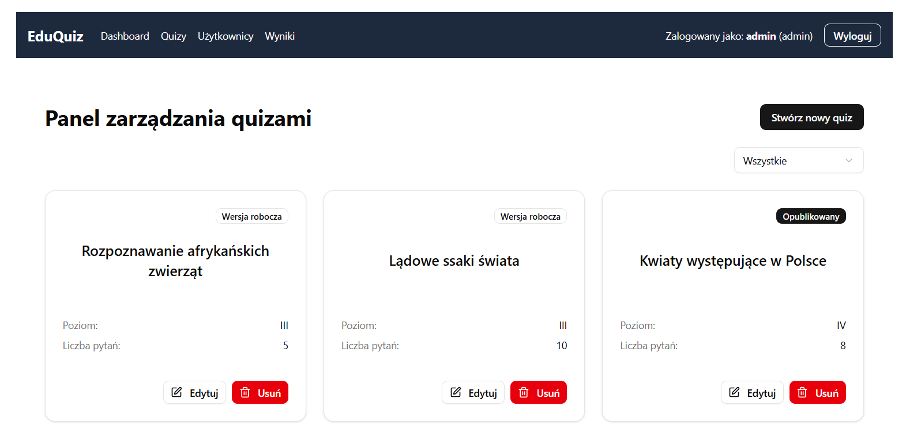

# EDU-QUIZ

[](https://github.com/your-repo/edu-quiz)
[](https://opensource.org/licenses/MIT)

An educational application for creating and conducting interactive, AI-powered quizzes.

## Table of Contents
1. [Project Description](#project-description)
2. [Tech Stack](#tech-stack)
3. [Project Structure](#project-structure)
4. [Getting Started Locally](#getting-started-locally)
5. [User Interface](#user-interface)
6. [Project Scope](#project-scope)
7. [Project Status](#project-status)
8. [Development Information/Statistics](#development-informationstatistics)
11. [License](#license)

## Project Description

EDU-QUIZ is an educational application designed for creating and conducting interactive quizzes at the school level. The system utilizes Artificial Intelligence (AI) to generate quiz content, aiming to simplify the workload for teachers and enhance student engagement.

The application addresses two main user problems:
-   **For the administrator (teacher):** It automates the time-consuming process of creating diverse and engaging quizzes, maintaining high-quality educational content.
-   **For the student:** It provides an interactive and engaging learning format with immediate feedback, motivating further learning through gamification elements.

The system distinguishes between two user roles: an **administrator**, who manages quizzes and accounts, and a **student**, who browses, launches, and completes quizzes, receiving instant feedback.

## Tech Stack

### Frontend
-   **React 19:** A popular framework for building dynamic and responsive user interfaces.
-   **Tailwind 4:** A utility-first CSS framework for convenient application styling.
-   **Shadcn/ui:** A component library providing accessible React components.

### Backend
-   **Python & FastAPI:** A modern, fast web framework for building APIs.
-   **Uvicorn:** An ASGI server for running the FastAPI application.
-   **OpenAI API:** For communication with LLM models to generate quiz content.

### Database
-   **SQLAlchemy:** An ORM for database management.
-   **SQLite:** The database engine used for the project.

### Authentication
-   **JWT (JSON Web Tokens):** Used for securing user authentication and session management, integrated within FastAPI.

### CI/CD & Hosting
-   **GitHub Actions:** For creating CI/CD pipelines.
-   **DigitalOcean:** For hosting the application via Docker images.

## Project Structure

This project is split into two main parts:
- **frontend/**: React 19 + Vite + Tailwind + Shadcn/ui (student/admin UI)
- **backend/**: Python FastAPI + SQLite (API server)

The backend is organized for future scalability, with distinct modules for routers, models, schemas, database connections, and core configuration.

For more detailed information about the backend structure, API endpoints, testing procedures, and rate limiting configuration, see the [Backend README](backend/README.md).

For comprehensive database management options, including GUI tools, command-line interfaces, debug endpoints, and programmatic access via SQLAlchemy, refer to the [Database Documentation](backend/README-db.md).

## Getting Started Locally

To set up and run the project on your local machine, follow these steps.

### Prerequisites
-   Node.js and npm
-   Python 3.8+ and pip
-   Git

### Installation & Setup

1.  **Clone the repository:**
    ```sh
    git clone https://github.com/your-repo/edu-quiz.git
    cd edu-quiz
    ```

2.  **Set up the Backend:**
    ```sh
    # Navigate to the backend directory
    cd backend

    # Create a virtual environment
    python -m venv venv
    source venv/bin/activate  # On Windows, use `venv\Scripts\activate`

    # Install dependencies
    pip install -r requirements.txt

    # Create a .env file and add your OpenAI API key
    # OPENAI_API_KEY="your_api_key_here"

    # Run the development server
    uvicorn app.main:app --reload
    ```
    The backend will be running at `http://127.0.0.1:8000`. You can test it by accessing the `http://127.0.0.1:8000/ping` endpoint.

3.  **Set up the Frontend:**
    ```sh
    # Navigate to the frontend directory
    cd frontend

    # Install dependencies
    npm install

    # Run the development server
    npm run dev
    ```
    The frontend will be running at `http://localhost:5173`.

## Default user accounts

On startup, the application automatically:
- Creates all database tables if they don't exist
- Seeds the database with:
  - Predefined difficulty levels (Classes I-VIII)
  - Default admin user
  - Default student user

You can use the following credentials to log in and test the application:

-   **Admin User:**
    -   **Username:** `admin`
    -   **Password:** `admin123`
-   **Student User:**
    -   **Username:** `student`
    -   **Password:** `student123`


## User Interface

Below are screenshots of the key interfaces in the application:

### Authentication

  
*Login screen where users can authenticate as either an administrator or a student.*

### Administrator Interface


*Administrator dashboard giving access to various features, including quiz management.*


*Administrator quiz management screen displaying all quizzes, with options to create, edit, delete, and status for each quiz.*

  
*Interface for creating a new quiz with AI assistance, allowing specification of topic, difficulty level, and number of questions.*


*Quiz editing interface where administrators can modify title, questions, answers, and publish/unpublish the quiz.*

### Student Interface


*Student dashboard providing access to various features, including browsing and taking quizzes.*


*List of available quizzes for students, displaying quiz title, difficulty level, and previous scores if applicable.*


*Quiz interface that allows students to answer questions, displays progress, and shows an AI-generated explanation after submitting an answer.*


*Summary screen displayed after completing a quiz, showing the final score.*

## Project Scope

### Key Features (MVP)
-   **AI Quiz Generation:** Generate quizzes based on topic, number of questions, and grade level (1-8).
-   **Admin Panel:** Full lifecycle management for quizzes (create, review, edit, publish, delete).
-   **Single-Choice Questions:** All questions are multiple-choice with four answer options.
-   **Student View:** Browse and take published quizzes.
-   **Instant Feedback:** Immediate correct/incorrect feedback with AI-generated explanations.
-   **Results Summary:** View a final score (e.g., 7/10) upon quiz completion.
-   **Score Persistence:** The last score for each quiz is saved and displayed on the quiz list.

### Out of Scope (For now)
-   User account management (the system uses one static admin and one static student account).
-   Admin view of detailed student statistics.
-   Time limits for quizzes.
-   Ability to resume an interrupted quiz.
-   Different types of questions (e.g., open-ended, multi-select).

## Project Status
This project is currently in the **MVP phase**. Core minimum features are being built and tested.

## Development Information/Statistics

-   **Tools used:** Cursor
-   **Models used:** **gemini-2.5-pro**, **claude-3.7-sonet**, o3-mini, gpt-4.1
-   **Work time:** Approximately one week
-   **Number of files in the project:** 185
-   **Number of lines of code/documentation in the project:** 24,745
-   **Percentage of generated (by AI) code/documentation:** I'd say around 98%
-   **Development Approach and Notes** – The MVP concept for the project was initially written manually. This was followed by fully supervised planning of individual tasks and implementation in collaboration with Cursor. The project was created as part of completing the [10xDevs training program](https://www.10xdevs.pl/). Throughout its development, I relied heavily on the knowledge, work techniques, and prompts provided during the course. However, the project was built using my own technology stack, with the frontend technologies partially overlapping with those recommended in the training.
-   **Code Quality Disclaimer** – While the code quality may not be optimal in all areas, the project was developed under tight time constraints for educational purposes and as part of the 10xDevs training completion. The main goal was to demonstrate how, with the right techniques and tools like Cursor, it’s possible to rapidly deliver a functional MVP version of an application.


## License
This project is licensed under the MIT License. See the [LICENSE](LICENSE.md) file for details.
